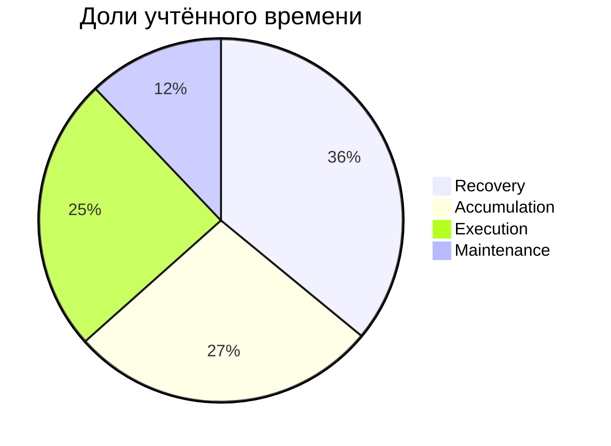
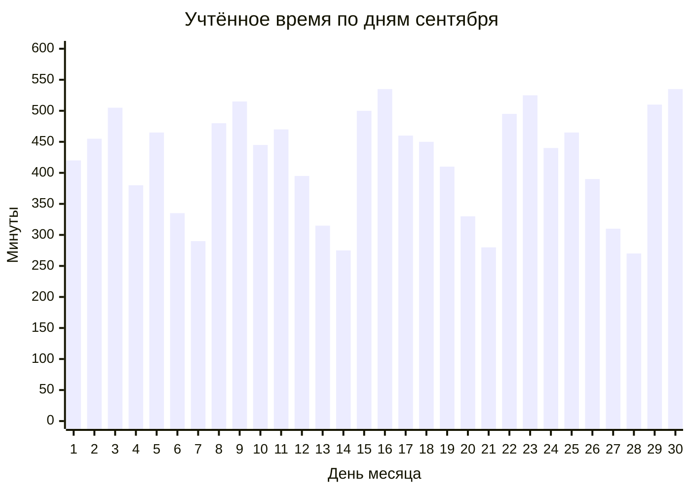

# Chronos · Сентябрь 2026

> [!summary] Итог месяца
> **210 ч 50 мин** учтено за 30 календарных дней. Покрытие месяца — **29,28 %**.

**Период:** 01.09.2026 00:00 — 01.10.2026 00:00  
**Часовой пояс:** `Europe/Istanbul`

> [!warning] Демонстрационные данные
> Числа в этой ноте придуманы для макета. Это не статистика продакшена.

## Распределение по категориям

| Категория | Время | Доля учтённого |
|:--|--:|--:|
| Recovery | 75 ч 50 мин | 35,97 % |
| Accumulation | 57 ч 50 мин | 27,43 % |
| Execution | 51 ч 40 мин | 24,51 % |
| Maintenance | 25 ч 30 мин | 12,09 % |
| **Всего** | **210 ч 50 мин** | **100 %** |

## Ритм по дням

Точные значения по дням:

| День | Учтено | День | Учтено | День | Учтено |
|--:|--:|--:|--:|--:|--:|
| 01 | 7 ч 00 мин | 11 | 7 ч 50 мин | 21 | 4 ч 40 мин |
| 02 | 7 ч 35 мин | 12 | 6 ч 35 мин | 22 | 8 ч 15 мин |
| 03 | 8 ч 25 мин | 13 | 5 ч 15 мин | 23 | 8 ч 45 мин |
| 04 | 6 ч 20 мин | 14 | 4 ч 35 мин | 24 | 7 ч 20 мин |
| 05 | 7 ч 45 мин | 15 | 8 ч 20 мин | 25 | 7 ч 45 мин |
| 06 | 5 ч 35 мин | 16 | 8 ч 55 мин | 26 | 6 ч 30 мин |
| 07 | 4 ч 50 мин | 17 | 7 ч 40 мин | 27 | 5 ч 10 мин |
| 08 | 8 ч 00 мин | 18 | 7 ч 30 мин | 28 | 4 ч 30 мин |
| 09 | 8 ч 35 мин | 19 | 6 ч 50 мин | 29 | 8 ч 30 мин |
| 10 | 7 ч 25 мин | 20 | 5 ч 30 мин | 30 | 8 ч 55 мин |

## Связь с веткой

@chronos_analytics

> [!note] Метод
> Доли категорий рассчитаны от учтённого времени. Покрытие рассчитано от полной длительности календарного месяца. Интервалы, пересекающие полночь, разделены по дням в указанном часовом поясе.
